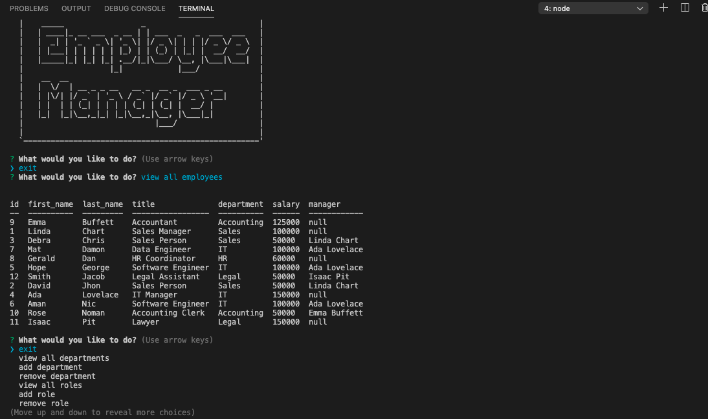

# Employee Tracker

Build a command-line application that at a minimum allows the user to add departments, roles, employees , view departments, roles, and update employee roles

## Walkthrough Demo:

## Installation

  - To install the dependencies, type `npm i` at the command line.

  - To source the `tracker_db` database:
    - type `mysql -u root -p` at the command line 
    - at the mysql prompt, type `source db/schema.sql` to migrate the tables structure and relations
    - at the mysql prompt, type `source db/seeds.sql` to migrate the data
  
  - In the `db/connection.js` file, change the password to yours.

  - To start the app, type `npm start` at the command line.
  

## Submission 

* The URL of the GitHub repository: https://github.com/betielbetu/EMPLOYEE-TRACKER

* A video demonstrating the entirety of the app's functionality: https://drive.google.com/file/d/1HrXuxcz-cY579JNJKq1fw9sSCBHwMwaV/view

- - -
© 2021 Betiel Mengesha. All Rights Reserved.
